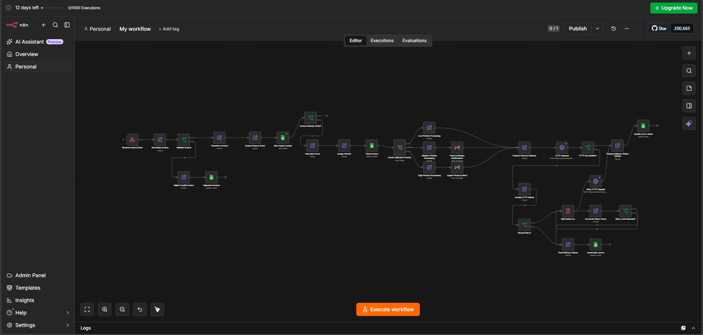
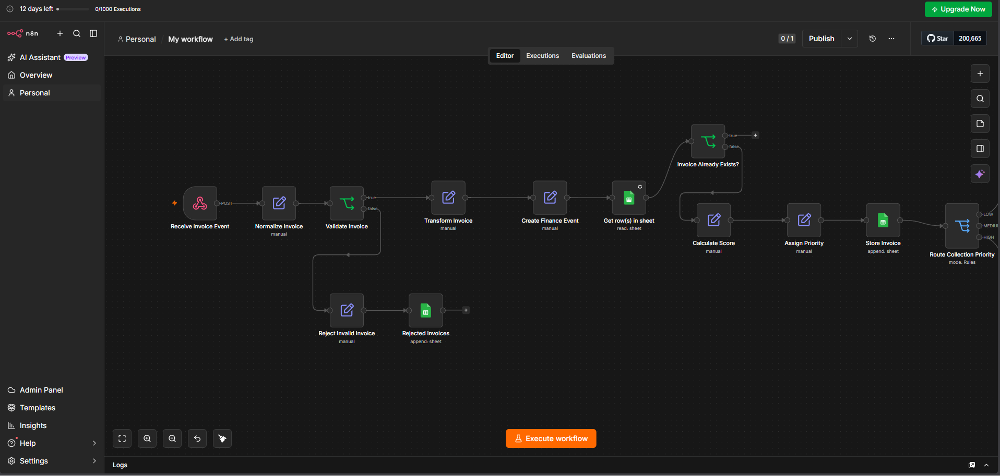
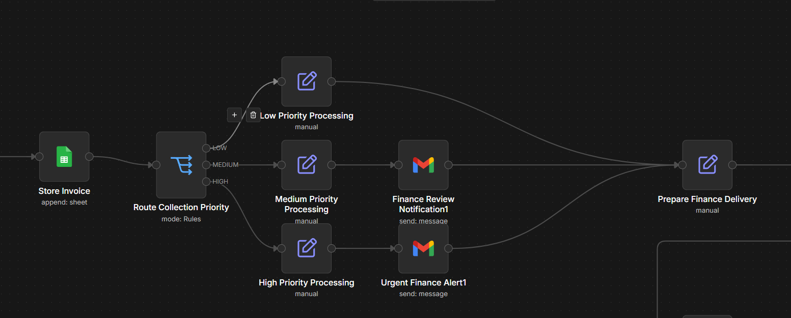
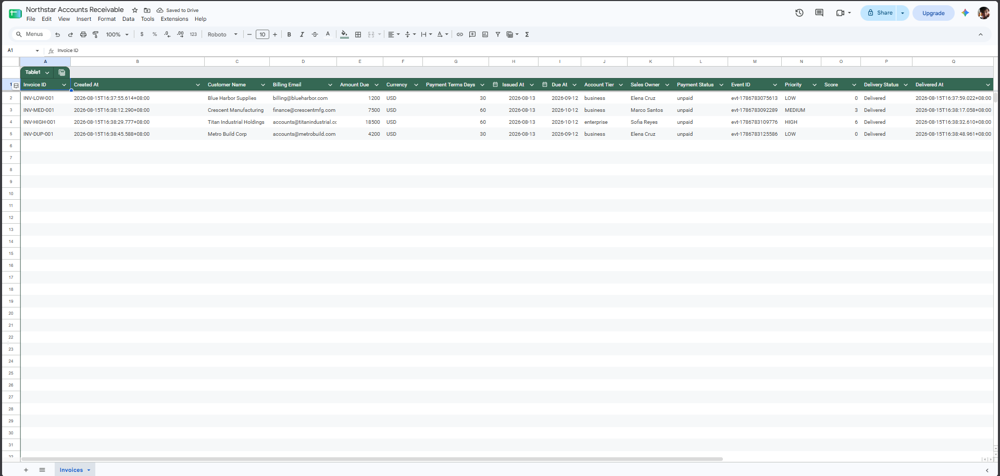
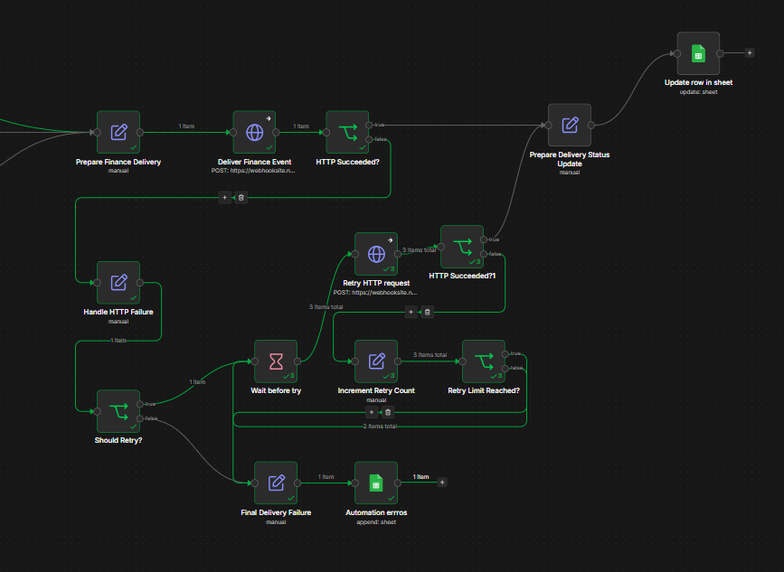
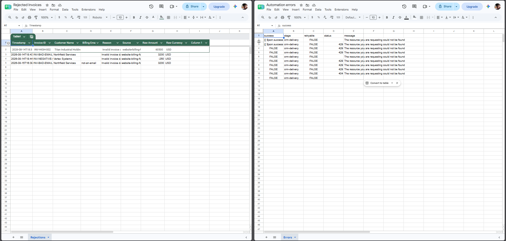

# Accounts Receivable Invoice Automation

A production-style invoice intake and delivery workflow built with **n8n**, designed to validate incoming billing data, prevent duplicate processing, prioritize invoices based on business rules, persist records in Google Sheets, route finance notifications, deliver structured events to an external system, and recover from temporary HTTP failures through controlled retries.

This project focuses on the parts of workflow automation that become important beyond the happy path: **validation, normalization, idempotency, routing, persistence, failure handling, retries, and operational visibility**.

---

## Overview

The workflow simulates an accounts receivable automation system receiving invoice events from an external billing source.

Instead of simply forwarding incoming webhook data, the workflow processes each invoice through several stages:

1. Receive the invoice through a webhook.
2. Normalize inconsistent incoming fields.
3. Validate required billing information.
4. Reject and log invalid invoices.
5. Transform valid input into an internal finance event.
6. Check Google Sheets for duplicate invoice IDs.
7. Calculate a collection-priority score.
8. Assign LOW, MEDIUM, or HIGH priority.
9. Store the accepted invoice.
10. Route the invoice according to priority.
11. Send finance notifications when required.
12. Prepare a standardized delivery payload.
13. Deliver the finance event through HTTP.
14. Detect unsuccessful delivery.
15. Retry eligible failures with a controlled retry loop.
16. Update delivery status after successful delivery.
17. Log permanent delivery failures for investigation.

The result is a workflow that handles both successful processing and several realistic failure scenarios.

---

## Architecture

```text
Incoming Billing System
        │
        ▼
Receive Billing Lead
        │
        ▼
Normalize Incoming Lead
        │
        ▼
Validate Lead
   ┌────┴─────┐
 INVALID     VALID
   │           │
   ▼           ▼
Reject       Transform Lead
Invalid          │
Lead             ▼
   │       Create Finance Event
   ▼             │
Rejected         ▼
Invoices    Get Row(s) in Sheet
                 │
                 ▼
        Invoice Already Exists?
            ┌────┴────┐
           YES        NO
            │          │
            ▼          ▼
           END    Calculate Score
                       │
                       ▼
                Assign Priority
                       │
                       ▼
                  Store Invoice
                       │
                       ▼
             Route Collection Priority
               ┌───────┼────────┐
               │       │        │
              LOW    MEDIUM    HIGH
               │       │        │
               │       ▼        ▼
               │    Finance   Urgent
               │     Review   Finance
               │     Notice    Alert
               │       │        │
               └───────┴────────┘
                       │
                       ▼
             Prepare Finance Delivery
                       │
                       ▼
                Deliver Finance Event
                       │
                       ▼
                 HTTP Succeeded?
                   ┌───┴───┐
                  YES      NO
                   │        │
                   ▼        ▼
             Prepare     Handle HTTP
             Delivery      Failure
              Status         │
              Update         ▼
                   │     Should Retry?
                   │       ┌──┴──┐
                   │      NO    YES
                   │       │      │
                   │       │      ▼
                   │       │   Wait Before Try
                   │       │      │
                   │       │      ▼
                   │       │   Retry HTTP
                   │       │    Request
                   │       │      │
                   │       │      ▼
                   │       │ Retry HTTP
                   │       │ Succeeded?
                   │       │  ┌───┴───┐
                   │       │ YES      NO
                   │       │  │        │
                   │       │  │        ▼
                   │       │  │    Increment
                   │       │  │    Retry Count
                   │       │  │        │
                   │       │  │        ▼
                   │       │  │   Retry Limit
                   │       │  │    Reached?
                   │       │  │    ┌───┴───┐
                   │       │  │   NO      YES
                   │       │  │    │        │
                   │       │  │    └─► WAIT │
                   │       │  │             │
                   │       ▼  │             ▼
                   │   Final Delivery ◄─────┘
                   │      Failure
                   │         │
                   │         ▼
                   │   Automation Errors
                   │
                   └─────────┐
                             ▼
                     Update Invoice Row
```

---

## Workflow Overview



The workflow is intentionally divided into several responsibilities rather than placing all business logic inside a single node.

This makes each stage easier to inspect, test, modify, and debug independently.

The main responsibilities are:

- intake and normalization
- validation and rejection
- event transformation
- duplicate detection
- scoring and prioritization
- persistence
- priority-based routing
- downstream delivery
- retry handling
- delivery-state updates
- failure logging

---

## Invoice Processing



Incoming billing data is treated as untrusted external input.

The normalization stage cleans and standardizes fields before downstream processing. This prevents later nodes from having to repeatedly compensate for inconsistent formatting.

Examples include:

- trimming invoice identifiers
- normalizing customer information
- standardizing email addresses
- converting monetary values to numbers
- standardizing account tiers
- converting payment terms into usable numeric values

The validation stage then determines whether the normalized invoice contains the information required for processing.

Invalid invoices do not enter the normal finance pipeline.

Instead, they are routed to a dedicated rejection path and recorded separately for inspection.

---

## Duplicate Protection

Before an invoice is stored, the workflow checks the invoice storage sheet using the normalized **Invoice ID**.

If the invoice already exists, the workflow prevents it from being processed again.

This provides a basic form of **idempotency**.

Without this check, repeated webhook deliveries could cause:

- duplicate invoice records
- repeated finance alerts
- duplicate downstream events
- incorrect operational reporting

Duplicate protection is particularly important for webhook-driven systems because upstream applications may resend events after network failures or timeouts.

---

## Priority Scoring

Accepted invoices receive a collection-priority score based on business rules.

The current scoring model considers:

- invoice amount
- customer account tier
- payment terms

An example scoring model is:

```text
Invoice Amount
≥ $10,000          +3
≥ $5,000           +2
Below $5,000       +0

Account Tier
Enterprise         +2
Other              +0

Payment Terms
Net 60             +1
Other              +0
```

The resulting score is converted into a collection priority such as:

```text
LOW
MEDIUM
HIGH
```

The scoring and priority assignment are intentionally separated into different workflow stages so that either business rule can be modified without redesigning the entire workflow.

---

## Priority Routing



After scoring, a Switch node routes invoices according to their assigned collection priority.

### LOW

Low-priority invoices continue through normal processing without requiring an additional finance notification.

### MEDIUM

Medium-priority invoices trigger a finance review notification before continuing to delivery.

### HIGH

High-priority invoices trigger an urgent finance alert before continuing to delivery.

All three branches eventually converge back into the common finance-delivery pipeline.

This allows business-specific actions to occur without duplicating the downstream delivery logic.

---

## Invoice Storage

Accepted invoices are persisted in Google Sheets.

The invoice sheet acts as a lightweight operational record of valid invoices accepted by the workflow.

Stored fields include information such as:

```text
Invoice ID
Created At
Customer Name
Billing Email
Amount Due
Currency
Payment Terms Days
Issued At
Due At
Account Tier
Sales Owner
Payment Status
Event ID
Priority
Score
Delivery Status
Delivered At
```

An invoice can therefore exist in storage even if downstream delivery later fails.

This is intentional.

The invoice record represents an invoice accepted by the system, while **Delivery Status** represents the state of the external delivery operation.

That separation prevents valid business data from disappearing simply because an external service is temporarily unavailable.

---

## Invoice Records



Successful delivery updates the corresponding invoice row using its Invoice ID.

For successfully delivered events, the workflow can record:

```text
Delivery Status: Delivered
Delivered At: <timestamp>
```

This separates invoice persistence from delivery state and makes the sheet useful for basic operational tracking.

---

## Finance Event Delivery

Before making the outbound HTTP request, the workflow creates a standardized delivery object.

This provides a boundary between internal workflow processing and the external destination.

The delivery flow is:

```text
Priority Processing
        │
        ▼
Prepare Finance Delivery
        │
        ▼
Deliver Finance Event
        │
        ▼
HTTP Succeeded?
```

The HTTP request is configured so that an unsuccessful request can continue through workflow-controlled error handling rather than terminating the entire execution immediately.

This allows the workflow itself to decide whether a particular failure should be retried.

---

## Retry System



Temporary downstream failures enter a controlled retry path.

The retry subsystem performs the following sequence:

```text
HTTP Failure
     │
     ▼
Should Retry?
     │
     ▼
Wait
     │
     ▼
Retry HTTP Request
     │
     ▼
Retry Succeeded?
  ┌──┴──┐
 YES    NO
  │      │
  │      ▼
  │   Increment Retry Count
  │      │
  │      ▼
  │   Retry Limit Reached?
  │      ├── NO ──► Wait
  │      │
  │      └── YES
  │           │
  │           ▼
  │      Final Failure
  │
  ▼
Update Delivery Status
```

The retry loop is deliberately bounded.

A permanently failing external service must not create an infinite workflow execution.

Once the configured retry limit is reached, processing exits the loop and enters the permanent-failure path.

Successful retries exit immediately and continue to the delivery-status update instead of performing unnecessary additional attempts.

---

## Failure Handling

The workflow distinguishes between multiple failure categories.

### Invalid Input

Malformed or incomplete invoice data is rejected before entering the finance-processing pipeline.

These records can be stored in a dedicated rejected-invoices sheet.

### Duplicate Invoice

An invoice whose normalized Invoice ID already exists is prevented from being processed again.

### Temporary Delivery Failure

Retryable downstream failures enter the retry system.

### Permanent Delivery Failure

If delivery continues to fail after the configured retry limit, the workflow exits the retry loop and records the incident in the automation error log.

---

## Failure Logs



Permanent delivery failures are separated from invoice records.

This gives the workflow two different operational data sets:

```text
Invoices
→ business records accepted by the workflow

Automation Errors
→ technical failures requiring investigation
```

Rejected invoice data is also kept separate from technical delivery errors because the two represent different problems.

A rejected invoice indicates a problem with incoming business data.

An automation error indicates a problem while processing or delivering otherwise valid data.

---

## Example Incoming Payload

The webhook accepts billing events shaped similarly to:

```json
{
  "invoice_number": " INV-2026-01591571 ",
  "customer": {
    "company_name": "  APEX CONSTRUCTION GROUP ",
    "contact_email": " ACCOUNTS@APEXBUILD.COM "
  },
  "invoice": {
    "amount": "8750.50",
    "currency": "USD",
    "payment_terms": "net30"
  },
  "issued_date": "2026-08-13",
  "due_date": "2026-09-12",
  "account_tier": "business",
  "sales_rep": "Elena Cruz"
}
```

The intentionally inconsistent formatting demonstrates why the normalization stage exists.

Downstream nodes operate on normalized internal data rather than depending directly on the original webhook structure.

---

## Example Request

A test event can be sent using JavaScript:

```javascript
fetch("YOUR_N8N_WEBHOOK_URL", {
  method: "POST",

  headers: {
    "Content-Type": "application/json"
  },

  body: JSON.stringify({
    invoice_number: " INV-2026-01591571 ",

    customer: {
      company_name: "  APEX CONSTRUCTION GROUP ",
      contact_email: " ACCOUNTS@APEXBUILD.COM "
    },

    invoice: {
      amount: "8750.50",
      currency: "USD",
      payment_terms: "net30"
    },

    issued_date: "2026-08-13",
    due_date: "2026-09-12",
    account_tier: "business",
    sales_rep: "Elena Cruz"
  })
})
  .then(response => response.text())
  .then(data => console.log(data))
  .catch(error => console.error(error));
```

> Do not commit private production webhook URLs, credentials, API keys, customer information, or other secrets to a public repository.

---

## Test Scenarios

The workflow was designed to be tested against more than the successful path.

Important scenarios include:

| Scenario | Expected Result |
|---|---|
| Valid low-priority invoice | Stored and delivered normally |
| Valid medium-priority invoice | Finance review notification + delivery |
| Valid high-priority invoice | Urgent finance alert + delivery |
| Invalid invoice | Rejected and logged |
| Duplicate invoice ID | Duplicate processing prevented |
| Successful HTTP delivery | Invoice marked as delivered |
| Retryable HTTP failure | Retry sequence begins |
| Successful retry | Retry loop exits and invoice is updated |
| Permanent HTTP failure | Retry limit reached and error logged |

Detailed test cases are documented in:

```text
docs/testing.md
```

---

## Repository Structure

```text
.
├── README.md
│
├── workflow/
│   └── invoice-collections-automation.json
│
├── docs/
│   ├── architecture.md
│   ├── setup.md
│   └── testing.md
│
└── assets/
    └── screenshots/
        ├── workflow-overview.png
        ├── invoice-processing.png
        ├── priority-routing.png
        ├── retry-system.png
        ├── invoice-records.png
        └── failure-logs.png
```

---

## Documentation

Additional documentation is available in the `docs` directory.

### Architecture

[`docs/architecture.md`](docs/architecture.md)

Explains the workflow structure, processing stages, routing decisions, persistence strategy, and failure-handling architecture.

### Setup

[`docs/setup.md`](docs/setup.md)

Contains the steps required to configure the workflow, Google Sheets integration, credentials, webhook, and external delivery endpoint.

### Testing

[`docs/testing.md`](docs/testing.md)

Contains test scenarios for validation, duplicate detection, priority routing, HTTP failures, retry behavior, and successful delivery.

---

## Tech Stack

- **n8n** — workflow orchestration and automation
- **Google Sheets** — invoice, rejection, and operational error storage
- **Gmail** — finance review and urgent-priority notifications
- **HTTP / Webhooks** — event intake and downstream finance-event delivery
- **JavaScript expressions** — normalization, transformation, scoring, and workflow logic

---

## What This Project Demonstrates

This project was built to practice workflow design beyond simple trigger-to-action automation.

It demonstrates:

- webhook-based event ingestion
- defensive input normalization
- business-data validation
- invalid-record isolation
- structured data transformation
- duplicate detection
- idempotency concepts
- business-rule scoring
- conditional priority assignment
- multi-branch routing
- Google Sheets persistence
- email-based operational notifications
- standardized outbound event construction
- HTTP integration
- explicit success/failure detection
- retry eligibility decisions
- delayed retries
- bounded retry loops
- recovery after successful retries
- permanent-failure handling
- automation error logging
- delivery-state tracking
- separation of business records from technical failures

---

## Design Decisions

### Store Before Delivery

Valid invoices are stored before attempting external delivery.

This ensures that accepted business data is not lost because a downstream service is temporarily unavailable.

Persistence and delivery are therefore treated as separate concerns.

### Separate Rejections From Automation Errors

Invalid incoming data and technical integration failures are different operational problems.

They are handled through separate paths so that they can be investigated independently.

### Explicit Priority Routing

Priority is calculated before routing rather than embedding business rules directly inside notification nodes.

This keeps scoring, classification, and actions independently maintainable.

### Bounded Retries

External failures are retried only a limited number of times.

This prevents infinite loops while still allowing temporary failures to recover automatically.

### Shared Delivery Pipeline

LOW, MEDIUM, and HIGH priority invoices may perform different actions, but they eventually converge into a common delivery path.

This avoids duplicating HTTP delivery and failure-handling logic across multiple branches.

---

## Possible Future Improvements

The current project intentionally uses accessible infrastructure so that the workflow architecture remains easy to inspect.

A production implementation could be extended with:

- PostgreSQL or another transactional database instead of Google Sheets
- stronger idempotency guarantees
- authentication and webhook signature verification
- schema-based request validation
- exponential backoff with jitter
- dead-letter queue processing
- centralized structured logging
- monitoring and alerting
- retryable vs non-retryable HTTP status classification
- environment-specific configuration
- secrets management
- automated integration tests
- dashboards for invoice and delivery metrics
- reconciliation workflows for failed deliveries

---

## Security Notes

This repository is intended to demonstrate workflow architecture.

Public versions of the project should never contain:

- n8n credentials
- Google credentials
- Gmail credentials
- API keys
- private webhook URLs
- authentication tokens
- production customer information
- private email addresses
- production spreadsheet IDs
- internal service endpoints

All examples and screenshots should use demonstration data.

---

## Project Status

**Completed — portfolio project**

Core functionality implemented:

- [x] Webhook intake
- [x] Input normalization
- [x] Validation
- [x] Invalid-invoice rejection
- [x] Finance-event transformation
- [x] Duplicate detection
- [x] Priority scoring
- [x] Priority assignment
- [x] Invoice persistence
- [x] LOW / MEDIUM / HIGH routing
- [x] Finance review notification
- [x] Urgent finance alert
- [x] HTTP delivery
- [x] HTTP failure handling
- [x] Controlled retry loop
- [x] Retry-limit enforcement
- [x] Successful delivery-state update
- [x] Permanent-failure logging
- [x] Setup documentation
- [x] Architecture documentation
- [x] Testing documentation
- [x] Portfolio screenshots

---

## Key Takeaway

The main challenge in this project was not sending an HTTP request or writing a row to a spreadsheet.

It was designing what happens when things **do not go according to plan**.

A useful automation needs to answer questions such as:

- What happens when incoming data is malformed?
- What happens when the same event arrives twice?
- Which invoices require human attention?
- What happens when an external service is unavailable?
- Which failures should be retried?
- When should retrying stop?
- How does a successful retry exit the failure loop?
- How can failed operations be investigated afterward?
- How can business records remain intact even when delivery fails?

Building those paths turned a linear automation into a more resilient event-processing workflow.

---

## Author

**Marvin Silverio**

Built as a portfolio project focused on workflow automation, integration design, and reliable business-process orchestration.
